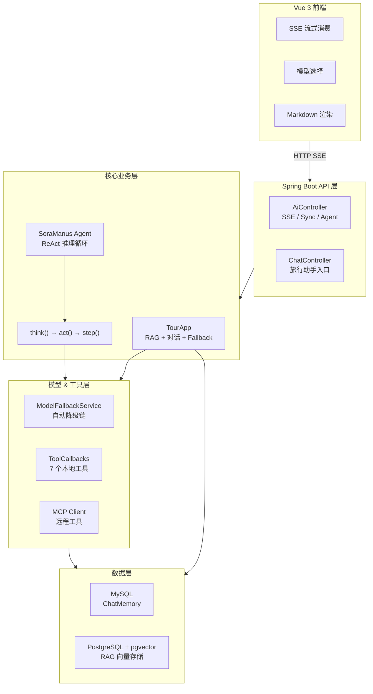

<p align="center">
  <h1 align="center">🤖 Sora Agent</h1>
  <p align="center">
    <strong>基于 Spring AI Alibaba 的通用 AI Agent 框架</strong>
    <br />
    ReAct 推理循环 · 多工具编排 · 模型自动降级 · 流式对话
  </p>
</p>

<p align="center">
  
  
  
  
  
  
  
  
  
  
  
</p>

---

## 🧠 架构概览



---

## ✨ 核心特性

- **🧩 ReAct 推理引擎** — 完整的 think → act → step 循环，Agent 自主决策何时调用工具、何时给出最终回复
- **🔧 多工具编排** — 7 个本地工具（文件读写、网页搜索、内容抓取、资源下载、终端操作、PDF 生成、任务终止）与 MCP 远程工具统一调度
- **🔄 模型自动降级** — 按配置顺序自动 Fallback，区分致命错误（401/403）与可恢复错误，带完整尝试历史追踪
- **🛡️ 三重死循环检测** — 文本重复检测 + 工具调用指纹比对 + 振荡模式识别（最近 N 步仅 2 种工具交替出现），自动注入提示引导 Agent 跳出循环
- **📡 SSE 流式输出** — 基于 SseEmitter / Flux 的流式对话，支持 model_info 命名事件，前端实时感知模型切换
- **📚 RAG 检索增强** — Query Rewrite + pgvector 向量存储 + 关键词元数据增强，多文档分批写入

<details>
<summary><strong>更多特性</strong></summary>

- **🎭 双模式对话** — TourApp（RAG 增强 + 对话记忆）与 Manus Agent（工具链调用）两种模式
- **🗄️ 多数据源** — MySQL（会话记忆）+ PostgreSQL（向量存储），MyBatis-Plus ORM
- **📝 结构化输出** — 支持 `entity(TourReport.class)` 将 LLM 回复直接映射为 Java Record
- **🌐 Knife4j 文档** — 内置 Swagger/Knife4j API 文档，开箱即用的接口调试
- **🎨 现代前端** — Vue 3 + TypeScript + Tailwind CSS，响应式设计，Markdown 渲染
- **🛠️ MCP 协议** — 集成 Spring AI MCP Client，支持 stdio 远程工具服务器
</details>

---

## 🚀 快速开始

### 环境要求

| 依赖 | 版本 | 说明 |
|------|------|------|
| JDK | 21+ | 编译目标 Java 17 |
| Node.js | 18+ | 前端构建 |
| DashScope API Key | — | [阿里云百炼平台](https://bailian.console.aliyun.com/) 获取 |

### 配置文件

项目依赖 `application-local.yml` 和 `mcp-servers.json`（已在 `.gitignore` 中排除）。项目提供了示例模板，复制并填入你自己的密钥即可：

```bash
# 从模板创建配置文件
cp src/main/resources/application-local.yml.example src/main/resources/application-local.yml
cp src/main/resources/mcp-servers.json.example src/main/resources/mcp-servers.json

# 然后编辑这两个文件，填入你的 API Key 和数据库连接信息
```

> **安全配置（必读）**：默认启用 API Key 认证。`application-local.yml` 的
> `app.security.api-keys` 至少配置一个 key，否则应用**拒绝启动**（fail-fast，防裸奔）。
> 开发模式下由前端 vite 代理注入 key（见 `sora_agent_frontend/.env.example` 的 `VITE_API_KEY`）；
> 生产部署由反向代理统一注入 `X-API-Key` 请求头。
> 危险工具（终端/文件/下载/抓取）默认全部关闭，按需在 `app.security.tools.*` 显式开启。
> 完整验收清单见 [docs/security-checklist.md](docs/security-checklist.md)。

### 5 分钟体验模式

此模式跳过 RAG 和数据库，只需 Java 和 Node.js，仅需配置 API Key。

```bash
# 1. 克隆项目
git clone https://github.com/UZQ-pomelo/sora_agent.git
cd sora_agent

# 2. 创建配置文件并填入 DashScope API Key（见上方"配置文件"）

# 3. 启动后端
./mvnw spring-boot:run

# 4. 启动前端（新终端）
cd sora_agent_frontend
npm install
npm run dev

# 5. 打开浏览器 → http://localhost:5173
```

### 完整模式（含 RAG + 对话记忆 + MCP 工具）

完整模式需要 PostgreSQL + pgvector、MySQL 和 MCP 服务器。推荐使用 Docker Compose：

```yaml
# docker-compose.yml（项目根目录）
version: '3.8'
services:
  mysql:
    image: mysql:8.0
    environment:
      MYSQL_ROOT_PASSWORD: <your-password>
      MYSQL_DATABASE: sora_agent
    ports:
      - "3306:3306"

  postgres:
    image: pgvector/pgvector:pg16
    environment:
      POSTGRES_USER: <your-username>
      POSTGRES_PASSWORD: <your-password>
      POSTGRES_DB: sora_agent
    ports:
      - "5432:5432"
```

```bash
# 1. 启动所有依赖
docker compose up -d

# 2. 创建配置文件，填入 API Key 和数据库连接信息（见上方"配置文件"）
#    PostgreSQL 连接地址改为 jdbc:postgresql://localhost:5432/sora_agent

# 3. 启动后端 & 前端
./mvnw spring-boot:run
cd sora_agent_frontend && npm run dev
```

### 一行代码创建 Agent

```java
// 注入依赖
@Resource private ToolCallback[] allTools;        // 本地工具
@Resource private ToolCallbackProvider toolCallbacks; // MCP 工具
@Resource private ChatModel dashscopeChatModel;   // 模型

// 创建并运行 Agent
SoraManus agent = new SoraManus(allTools, toolCallbacks,
        dashscopeChatModel, "deepseek-v4-flash");
SseEmitter emitter = agent.runStream("帮我搜索 Spring AI 的最新资讯并生成一份 PDF 报告");
// 前端通过 SSE 实时接收每一步的执行进展
```

---

## 📂 项目结构

```
sora_agent/
├── src/main/java/com/sora/sora_agent/
│   ├── agent/                # Agent 核心引擎
│   │   ├── BaseAgent.java        # 抽象基类：状态管理、步骤循环
│   │   ├── ReActAgent.java       # ReAct 模式：think → act
│   │   ├── ToolCallAgent.java    # 工具调用 + 死循环检测
│   │   ├── SoraManus.java        # Manus 超级智能体
│   │   └── model/AgentState.java # 状态枚举（IDLE→RUNNING→FINISHED/STUCK/ERROR）
│   ├── app/TourApp.java      # 示例应用：旅游助手（RAG + 对话）
│   ├── controller/           # REST API
│   │   ├── AiController.java    # Agent / Tour 流式 & 同步接口
│   │   └── ChatController.java  # 旅行助手对话接口
│   ├── service/              # 模型降级服务
│   │   └── ModelFallbackService.java  # Fallback 链 + 错误分类
│   ├── tool/                 # 7 个本地工具
│   │   ├── FileOperationTool.java     # 文件读写
│   │   ├── ExaWebSearchTool.java      # 网页搜索
│   │   ├── WebScrapingTool.java       # 内容抓取
│   │   ├── ResourceDownloadTool.java  # 资源下载
│   │   ├── TerminalOperationTool.java # 终端操作
│   │   ├── PDFGenerationTool.java     # PDF 生成
│   │   ├── TerminateTool.java         # 任务终止
│   │   └── ToolRegistration.java      # 工具注册配置
│   ├── rag/                  # RAG 检索增强
│   │   ├── TourAppVectorStoreConfig.java
│   │   ├── TourAppDocumentLoader.java
│   │   ├── QueryRewriter.java
│   │   └── MyKeywordMetadataEnricher.java
│   ├── config/               # 配置（CORS、模型列表等）
│   └── chatmemory/           # MySQL 对话记忆
├── sora_agent_frontend/      # Vue 3 前端
│   └── src/
│       ├── views/            # TourChatPage / ManusChatPage / HomePage
│       ├── components/       # ChatContainer / ChatBubble / ChatInput
│       ├── router/           # Vue Router 路由定义
│       ├── types/chat.ts     # TypeScript 类型定义
│       └── utils/sse.ts      # SSE 流式客户端
├── pom.xml                   # Maven 依赖
└── docker-compose.yml        # 完整模式依赖编排
```

---

## 🏗️ 核心设计

### ReAct 推理循环

Agent 的执行遵循 **Reasoning + Acting** 模式，每一步由 `think()` 和 `act()` 两个阶段组成：

```java
// ReActAgent.step() — 核心循环（简化示意）
public String step() {
    boolean shouldAct = think();      // ① 推理：LLM 决定是否需要调用工具
    if (!shouldAct) {
        setState(AgentState.FINISHED); // LLM 给出最终回复，任务结束
        return assistantMessage.getText();
    }
    return act();                     // ② 执行：调用工具，结果写回上下文
}
```

```
用户输入 → think() → 需要工具? ──是──→ act() → 结果回写 → think() → ...
                          │
                          否
                          ↓
                    输出最终回复（FINISHED）
```

### 死循环检测

ToolCallAgent 在父类文本重复检测之上，叠加了 **工具调用级别** 的两重检测：

| 检测机制 | 判断逻辑 | 阈值 |
|---------|---------|------|
| **连续同工具** | 同一工具（同参数指纹）连续调用 N 次 | ≥ 4 次 |
| **振荡模式** | 最近 N 步中仅出现 2 种工具，且各出现 M 次 | 窗口 6 步，各 ≥ 3 次 |

检测到循环后，`handleStuckState()` 向 Agent 注入提示引导其调整策略；超过 `maxStuckCount` 后强制终止（`STUCK` 状态）。

### 模型自动降级

```
用户请求 qwen-turbo → 403（未授权）→ fallback 至 deepseek-v4-flash → ✅ 成功
                                                                       ↓
                                                        前端收到 model_info 事件：
                                                        { model: "deepseek-v4-flash", fallback: true }
```

- **Fallback 链**：目标模型排第一，其余按配置文件顺序附后
- **错误分类**：区分超时、连接失败、限流、余额不足、403/401 等
- **致命错误**：401（API Key 无效）、403（模型未授权）不触发 Fallback，直接中断

---

## 🌍 示例应用 — 小途旅行助手

"小途"是框架内置的示例应用，展示如何基于 Sora Agent 构建垂直领域 AI 助手。

### 能力

- 🗺️ **智能行程规划** — 多轮对话中理解用户偏好，结合 RAG 知识库推荐目的地和路线
- 🍜 **美食景点推荐** — 通过 MCP 地图工具搜索周边 POI
- 📄 **旅行报告生成** — 结构化输出 + PDF 导出
- 🧠 **对话记忆** — MySQL ChatMemory，跨会话保持上下文

### 知识库

RAG 知识文档覆盖旅行规划的三大领域（可添加）：

```
src/main/resources/document/
├── 行程规划与目的地选择.md    # 目的地推荐、行程设计
├── 交通出行与路线决策.md      # 交通方式、路线优化
└── 衣食住行与预算管理.md      # 住宿、美食、费用管理
```

### 接口示例

```bash
# 流式对话（SSE）
curl -G 'http://localhost:8080/api/ai/tour_app/chat/server' \
  --data-urlencode 'message=帮我规划3天广州亲子游' \
  --data-urlencode 'chatId=my-session-001'

# 同步对话
curl -G 'http://localhost:8080/api/chat' \
  --data-urlencode 'message=广州有哪些必吃的美食？' \
  --data-urlencode 'chatId=my-session-001'
```

---

## 🛠️ 技术栈

| 层级 | 技术 | 说明 |
|------|------|------|
| **框架** | Spring Boot 3.5、Spring AI Alibaba | 后端基础框架 + AI Agent 框架 |
| **Agent** | ReAct 模式、ToolCallingManager | 推理-行动循环 + 工具调用管理 |
| **模型接入** | DashScope SDK、LangChain4j | 阿里云百炼平台多模型调用 |
| **RAG** | pgvector、Query Rewrite | PostgreSQL 向量检索 + 查询重写 |
| **工具** | Exa Search、Jsoup、iText | 网页搜索、内容解析、PDF 生成 |
| **MCP** | Spring AI MCP Client | stdio 远程工具服务器集成 |
| **数据** | MySQL、PostgreSQL、MyBatis-Plus | 对话记忆 + 向量存储 |
| **前端** | Vue 3、TypeScript、Tailwind CSS | SPA 应用，SSE 流式消费 |
| **构建** | Vite、Maven | 前端/后端构建工具 |
| **文档** | Knife4j / OpenAPI 3 | API 文档自动生成 |

---

## 📄 许可证

本项目基于 [MIT License](LICENSE) 开源。

---

<p align="center">
  <sub>如果这个项目对你有帮助，欢迎给一个 ⭐ Star</sub>
</p>
